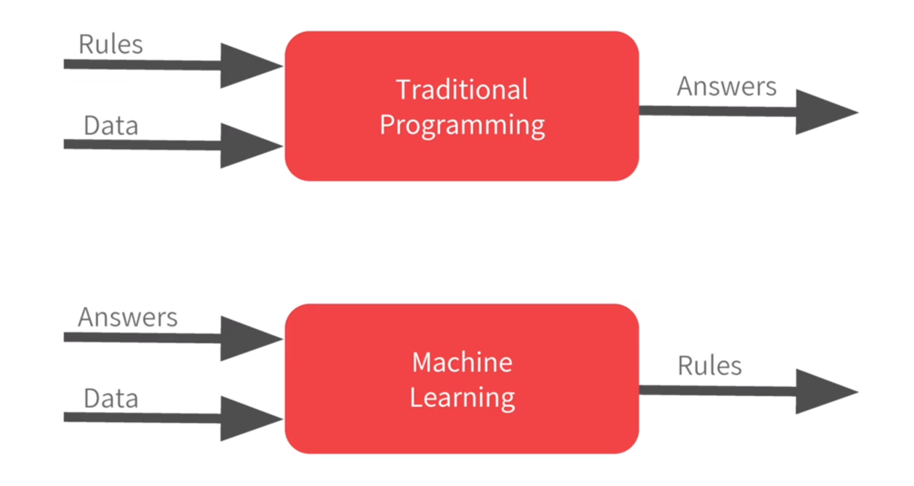
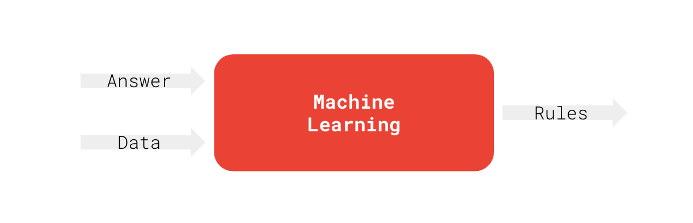

## Paradigmas de programação

Computadores e humanos têm formas diferentes de processar informações.

::: {.columns}

::: {.column width="45%"}

**Programação Tradicional**

* Regras explícitas
* Programação baseada em lógica
* Difícil de lidar com tarefas complexas

**Aprendizagem de Máquina**

* Aprendizado a partir de dados
* Programação baseada em exemplos
* Capaz de lidar com tarefas complexas
:::

::: {.column .v-center-column width="55%"}
{width="90%"}
:::

:::

Tarefas complexas: reconhecimento de voz, visão computacional, tradução automática, etc.

---

## Tarefa complexa

Como classificar um e-mail como spam ou não-spam?

::: {.column .h-center-column width="70%"}
{width="100%"}
:::

$$y = f(x)$$

---


## Aprendizagem de máquina: definição

::: {.columns}

::: {.column .v-center-column width="55%"}
{width="90%"}
:::

::: {.column width="45%"}

* Dados $x$: características ou atributos de um exemplo;
* Resposta $y$: o que queremos prever ou classificar;
* Algoritmo de aprendizagem $f$: processo que aprende a partir dos dados;

:::

:::


---

## Ajuste de curva - Polinomial

Considera-se o problema de regressão: ajustar uma curva polinomial $\hat{y}(x)$ a um conjunto de $n$ pontos $\{(x_i, y_i)\}_{i=1}^n$. O objetivo é encontrar um polinômio (modelo) de grau $M$ que melhor se ajuste aos dados, o qual é dado por:
$$\hat{y}(x, \mathbf{w}) = w_0 + w_1 x + w_2 x^2 + \ldots + w_M x^M = \sum_{j=0}^M w_j x^j$$

Neste caso $\hat{y}(x, \mathbf{w})$ é a função de predição do modelo. Que explica, com algum erro $e_i$ a relação entre $x_i$ e $y_i$:
$$ \hat{y}(x_i, \mathbf{w}) = y_i + e_i$$

---

## Ajuste de curva - Polinomial

O modelo polinomial pode ser reescrito de forma mais compacta utilizando notação vetorial com o vetor de características $\boldsymbol{\phi}(x) = [1, x, x^2, \ldots, x^M]^T$ e o vetor de pesos $\mathbf{w} = [w_0, w_1, w_2, \ldots, w_M]^T$ com o produto escalar:

$$
\hat{y}(x, \mathbf{w}) = 
\begin{array}[t]{c}
\begin{bmatrix} w_0 & w_1 & \cdots & w_M \end{bmatrix}
\end{array}
\begin{array}[t]{c}
\begin{bmatrix} 1 \\ x \\ \vdots \\ x^M \end{bmatrix}
\end{array}
$$

Ou seja:
$$\hat{y}(x, \mathbf{w}) = \mathbf{w}^T \boldsymbol{\phi}(x)$$


---

## Ajuste de curva - Polinomial

O ajuste dos dados $\{(x_i, y_i)\}_{i=1}^n$ ao modelo $\hat{y}(x, \mathbf{w})$ é medido por uma função de erro $E(\mathbf{w})$, como a função de erro quadrático:
$$E(\mathbf{w}) = \frac{1}{2} \sum_{i=1}^n (\hat{y}(x_i, \mathbf{w}) - y_i)^2$$

O objetivo é encontrar os pesos $\mathbf{w}$ que minimizam $E(\mathbf{w})$ para um dado modelo, ou seja:
$$\mathbf{w}^* = \arg\min_{\mathbf{w}} E(\mathbf{w})$$

Diz-se que $\mathbf{w}^*$ é a solução ótima do problema de ajuste de curva.

---

## Ajuste de curva - Polinomial

Utilizando toda a massa de dados $E(\mathbf{w})$ pode ser expressa na forma vetorial:

$$E(\mathbf{w}) = \frac{1}{2} \mathbf{e}^T \mathbf{e}$$

com o vetor de erros $\mathbf{e} = [e_1, e_2, \ldots, e_n]^T$,  com $e_i = \mathbf{w}^T \boldsymbol{\phi}(x_i) - y_i$. Neste caso:
$$\mathbf{e} = \hat{\mathbf{y}} - \mathbf{y}\qquad  \text{ou seja: }\mathbf{e} = \mathbf{X}\mathbf{w} - \mathbf{y}\text{,} \qquad\text{uma vez que}\qquad\hat{\mathbf{y}} = \mathbf{X}\mathbf{w}.$$

$\mathbf{X}$ é a matriz de regressão $n \times (M+1)$ e $\mathbf{y}$ o vetor de respostas. Em formato matricial:

$$\begin{bmatrix} y_1 \\ y_2 \\ \vdots \\ y_n \end{bmatrix} = 
\begin{bmatrix} 
1 & x_1 & x_1^2 & \cdots & x_1^M \\
1 & x_2 & x_2^2 & \cdots & x_2^M \\
\vdots & \vdots & \vdots & \ddots & \vdots \\
1 & x_n & x_n^2 & \cdots & x_n^M 
\end{bmatrix}
\begin{bmatrix} w_0 \\ w_1 \\ \vdots \\ w_M \end{bmatrix}
\qquad \qquad$$

---

## Ajuste de curva - Polinomial

Aplicando em $E(\mathbf{w})$:

$$E(\mathbf{w}) = \frac{1}{2} \mathbf{e}^T \mathbf{e} = \frac{1}{2} (\mathbf{X}\mathbf{w} - \mathbf{y})^T (\mathbf{X}\mathbf{w} - \mathbf{y})$$

Expandindo a expressão, tem-se:
$$E(\mathbf{w}) = \frac{1}{2} \left( \mathbf{w}^T \mathbf{X}^T \mathbf{X} \mathbf{w} - \mathbf{w}^T \mathbf{X}^T \mathbf{y} - \mathbf{y}^T \mathbf{X} \mathbf{w}  + \mathbf{y}^T \mathbf{y}\right)$$

Como $\mathbf{w}^T \mathbf{X}^T \mathbf{y}$ é um escalar, tem-se $\mathbf{w}^T \mathbf{X}^T \mathbf{y} = (\mathbf{w}^T \mathbf{X}^T \mathbf{y})^T = \mathbf{y}^T \mathbf{X} \mathbf{w}$, ou seja:
$$E(\mathbf{w}) = \frac{1}{2} \left( \mathbf{w}^T \mathbf{X}^T \mathbf{X} \mathbf{w} - 2\mathbf{w}^T \mathbf{X}^T \mathbf{y} + \mathbf{y}^T \mathbf{y}\right)$$


---

## Ajuste de curva - Polinomial

Pode-se determinar $\mathbf{w}^*$ de forma analítica extremando $E(\mathbf{w})$ em relação a $\mathbf{w}$, ou seja, encontrando os pontos críticos onde o gradiente de $E(\mathbf{w})$ é zero. 

Derivando $E(\mathbf{w})$ em relação a $\mathbf{w}$ e igualando a zero, tem-se:
$$\nabla E(\mathbf{w}) = \mathbf{X}^T \mathbf{X} \mathbf{w} - \mathbf{X}^T \mathbf{y} = 0$$

Então,

$$\mathbf{X}^T \mathbf{X} \mathbf{w} = \mathbf{X}^T \mathbf{y}$$

De onde se obtém a solução analítica para $\mathbf{w}^*$, conhecida como solução de mínimos quadrados ordinários (OLS):

$$\mathbf{w}^* = (\mathbf{X}^T \mathbf{X})^{-1} \mathbf{X}^T \mathbf{y}$$

---

## Ex: Ajuste de curva - Polinomial

Considera-se um conjunto de dados gerados a partir de uma função seno $y = \sin(x)$ com ruído gaussiano $\epsilon \sim \mathcal{N}(0, \sigma^2)$. O objetivo é ajustar um modelo polinomial aos dados. Em python pode-se gerar $N = 10$ amostras de $x$ uniformemente distribuídas no intervalo $[0, 2\pi]$ e calcular os valores correspondentes de $y$ com ruído:

```{python}
#| echo: true
#| output: false
import matplotlib.pyplot as plt
import numpy as np

np.random.seed(42)

# Número de amostras
N = 10

# Entrada
x = np.linspace(0, 2*np.pi, N)

# base de tempo para a sin(x)
x_true = np.linspace(0, 2*np.pi, 100)
# Ruído gaussiano
noise = np.random.normal(0, 0.2, N)

# Saída
y = np.sin(x) + noise

# reshape para ML
X = x.reshape(-1,1)

plt.scatter(x, y, label='Dados ruidosos')
plt.plot(x_true, np.sin(x_true), color='green', label='Função verdadeira')
plt.legend()
plt.show()
```

---

## Ex: Ajuste de curva - Polinomial

O que resulta:

```{python}
#| echo: false
#| output: true
import matplotlib.pyplot as plt
import numpy as np

np.random.seed(42)

# Número de amostras
N = 10

# Entrada
x = np.linspace(0, 2*np.pi, N)

# base de tempo para a sin(x)
x_true = np.linspace(0, 2*np.pi, 100)
# Ruído gaussiano
noise = np.random.normal(0, 0.2, N)

# Saída
y = np.sin(x) + noise

# reshape para ML
X = x.reshape(-1,1)

plt.scatter(x, y, label='Dados ruidosos')
plt.plot(x_true, np.sin(x_true), color='green', label='Função verdadeira')
plt.legend()
plt.show()
```

---

## Ex: Ajuste de curva - Polinomial

A matriz de regressão $\mathbf{X}$ pode ser gerada por:

```{python}
#| echo: true
#| output: true
import numpy as np

def MatrizRegressao(x, M):
    """
    Gera a matriz de regressão X para um polinômio de grau M.
    n: número de pontos em x
    M: grau do polinômio (gera M+1 colunas)
    """
    n = len(x)
    X = np.zeros((n, M + 1))
    for j in range(M + 1):
        X[:, j] = x**j
        
    return X
```

---

## Ex: Ajuste de curva - Polinomial

```{python}
#| echo: true
#| output: true
import numpy as np

def MinimosQuadrados(X, y):
    """
    Calcula o vetor de pesos w utilizando a Equação Normal.
    w = (X.T @ X)^-1 @ X.T @ y
    """
    # Matriz de regressão X e vetor de respostas y:
    w = np.linalg.inv(X.T @ X) @ X.T @ y
    
    return w
```

## Ex: Ajuste de curva - Polinomial

Para um modelo polinomial de grau $M=3$, tem-se:

```{python}
#| echo: true
#| output: true

# 1. Definir o grau do polinômio
M = 3

# 2. Gerar a matriz de regressão
X_matriz = MatrizRegressao(x, M)

# 3. Calcular os pesos ótimos
w_otimo = MinimosQuadrados(X_matriz, y)

print(f"Coeficientes do polinômio (M={M}):")
for i, coef in enumerate(w_otimo):
    print(f"w{i}: {coef:.4f}")
```
---

## Ex: Ajuste de curva - Polinomial

Modelo de grau $M=3$: Resultado.

```{python}
#| echo: false
#| output: true
import matplotlib.pyplot as plt
import numpy as np

# Configuração dos dados (reutilizando N=10 dos blocos anteriores)
np.random.seed(42)
N = 10
x = np.linspace(0, 2*np.pi, N)
y = np.sin(x) + np.random.normal(0, 0.2, N)

# Modelo ajustado (Grau M=3)
M = 3
X_matriz = MatrizRegressao(x, M)
w_otimo = MinimosQuadrados(X_matriz, y)

# Gerar pontos para a curva de teste (alta resolução)
x_test = np.linspace(0, 2*np.pi, 100)
X_test_matriz = MatrizRegressao(x_test, M)
y_pred = X_test_matriz @ w_otimo

# Gráfico da função verdadeira para comparação
y_true = np.sin(x_test)

# Plotagem
plt.figure(figsize=(10, 7))
plt.scatter(x, y, facecolor="none", edgecolor="blue", s=80, label='Dados ruidosos ($y$)')
plt.plot(x_test, y_true, color='green', linewidth=2, label='$\sin(x)$ (Verdadeiro)')
plt.plot(x_test, y_pred, color='red', linewidth=2, label=f'Ajuste Polinomial (M={M})')
plt.xlabel("x")
plt.ylabel("y")
plt.title(f"Ajuste de Mínimos Quadrados (w={w_otimo.shape[0]} parâmetros)")
plt.legend()
plt.grid(True, linestyle='--', alpha=0.5)
plt.show()
```

## Ajuste de curva - Polinomial - Complexidade (Grau $M$)

Abaixo, comparamos o ajuste de polinômios de diferentes graus sobre o mesmo conjunto de 10 dados ruidosos.

```{python}
#| echo: false
#| output: true
import matplotlib.pyplot as plt
import numpy as np

# --- 1. Configuração e Geração de Dados (Compartilhados) ---
np.random.seed(42)
N = 10
x = np.linspace(0, 2*np.pi, N)
# Função verdadeira + ruído
y_true_points = np.sin(x)
y = y_true_points + np.random.normal(0, 0.2, N)

# Base de alta resolução para plotar as curvas suaves
x_test = np.linspace(0, 2*np.pi, 100)
y_true_curve = np.sin(x_test)

# --- 2. Definição das Funções (Necessário repetir se não estiverem no mesmo arquivo) ---
def MatrizRegressao(x_input, M_degree):
    n_points = len(x_input)
    X_matrix = np.zeros((n_points, M_degree + 1))
    for j in range(M_degree + 1):
        X_matrix[:, j] = x_input**j
    return X_matrix

def MinimosQuadrados(X_matrix, y_vector):
    # Usando solve por estabilidade, especialmente para M=9
    XtX = X_matrix.T @ X_matrix
    Xty = X_matrix.T @ y_vector
    w_sol = np.linalg.solve(XtX, Xty)
    return w_sol

# --- 3. Geração dos Subplots 2x2 ---
graus = [0, 1, 3, 9]
fig, axes = plt.subplots(2, 2, figsize=(10, 8), sharex=True, sharey=True)
axes = axes.flatten() # Facilita a iteração sobre os 4 plots

for i, M in enumerate(graus):
    ax = axes[i]
    
    # Treinamento do modelo
    X_treino = MatrizRegressao(x, M)
    w_otimo = MinimosQuadrados(X_treino, y)
    
    # Predição na base de teste (alta resolução)
    X_teste = MatrizRegressao(x_test, M)
    y_pred = X_teste @ w_otimo
    
    # Plotagem
    ax.scatter(x, y, facecolor="none", edgecolor="blue", s=50, label='Dados')
    ax.plot(x_test, y_true_curve, color='green', linewidth=1.5, label='$\sin(x)$')
    ax.plot(x_test, y_pred, color='red', linewidth=2, label=f'Ajuste (M={M})')
    
    # Customização do subplot
    ax.set_title(f'Grau M = {M}', fontsize=12)
    ax.grid(True, linestyle='--', alpha=0.5)
    
    # Adicionar legenda apenas no primeiro plot para não poluir
    if i == 0:
        ax.legend(fontsize=9, loc='upper right')

# Ajuste fino do layout
plt.tight_layout()
plt.show()
```

---

## Ex: Ajuste de curva - Polinomial - Comparação dos Parâmetros $\mathbf{w}$


```{python}
#| echo: false
#| output: true
import pandas as pd
import numpy as np

# Graus para comparação
graus = [0, 1, 3, 9]
dados_tabela = {}

for M in graus:
    # Cálculo dos pesos (reutilizando as funções e dados anteriores)
    X_m = MatrizRegressao(x, M)
    w_m = MinimosQuadrados(X_m, y)
    
    # Formata os números com 4 casas e preenche o restante com vazio
    lista_w = [f"{val:.4f}" for val in w_m]
    vazios = [""] * (10 - len(lista_w))
    dados_tabela[f'M = {M}'] = lista_w + vazios

# Criando o DataFrame com os índices w0 a w9
df_pesos = pd.DataFrame(dados_tabela, index=[f'w{i}' for i in range(10)])

# Exibe a tabela (o Quarto renderiza o DataFrame do Pandas como HTML automaticamente)
df_pesos
```

---

---
title: "Aprendizagem de Máquina"
format: revealjs
---

## Regularização: Controlando a Complexidade

Para evitar o **Overfitting** em modelos de alto grau ($M=9$), adiciona-se uma penalidade ao erro que "segura" o crescimento dos pesos $\mathbf{w}$.

### 1. Função de Erro Regularizada ($\tilde{E}$)
Modigica-se o erro quadrático original adicionando um termo de penalidade (Norma $L_2$):

$$\tilde{E}(\mathbf{w}) = \frac{1}{2} \sum_{n=1}^{N} \{y(x_n, \mathbf{w}) - t_n\}^2 + \frac{\lambda}{2} \|\mathbf{w}\|^2$$

Onde $\|\mathbf{w}\|^2 = w_0^2 + w_1^2 + \dots + w_M^2$ e $\lambda$ controla a intensidade da penalidade.

---

## O Papel do Parâmetro $\lambda$

A regularização cria um compromisso (*trade-off*) entre o ajuste aos dados e a suavidade da curva:

* **$\lambda$ muito pequeno ($\ln \lambda = -18$):** * A penalidade é quase nula. 
    * O modelo foca em passar por todos os pontos (alto erro de generalização).
* **$\lambda$ moderado ($\ln \lambda = 0$):** * Os pesos são forçados a valores menores.
    * A curva torna-se mais suave e próxima da função original $\sin(x)$.

---

## Por que Regularizar?

1.  **Estabilidade Numérica:** Evita que os coeficientes assumam valores astronômicos (positivos e negativos) para compensar o ruído.
2.  **Simplicidade:** Força o modelo a escolher a solução mais "simples" (pesos menores) que ainda explique os dados.
3.  **Generalização:** Melhora a performance do modelo em dados que ele ainda não viu, ignorando oscilações espúrias causadas pelo ruído.

> **Conclusão:** A regularização permite usar modelos flexíveis (alto $M$) sem sofrer com a instabilidade do Overfitting.