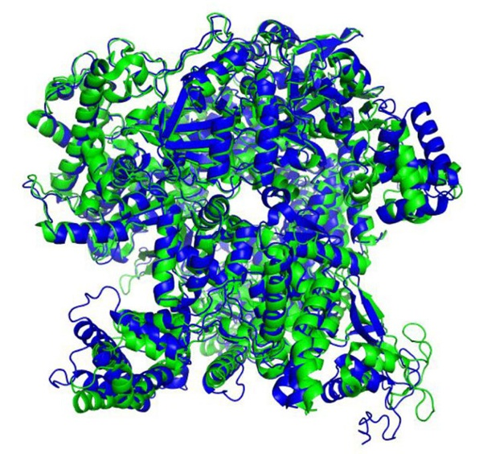
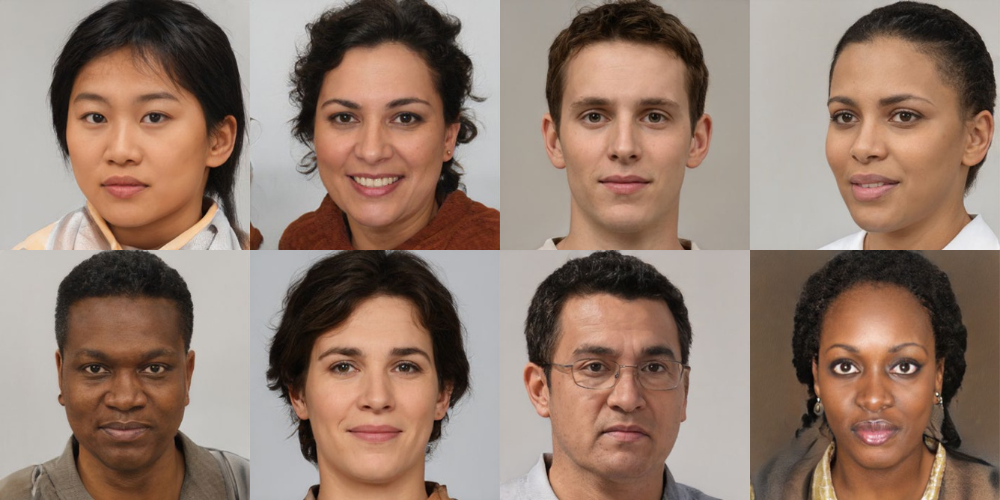
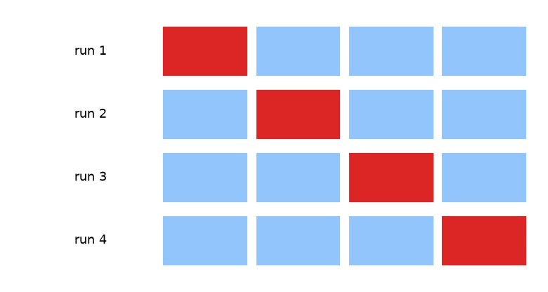
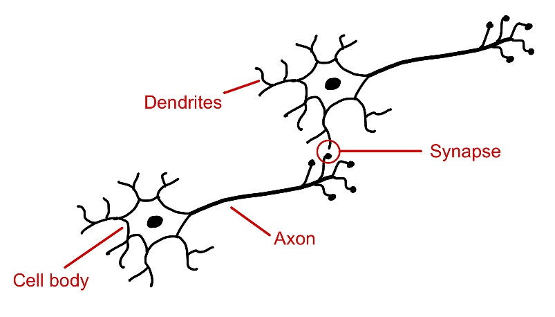
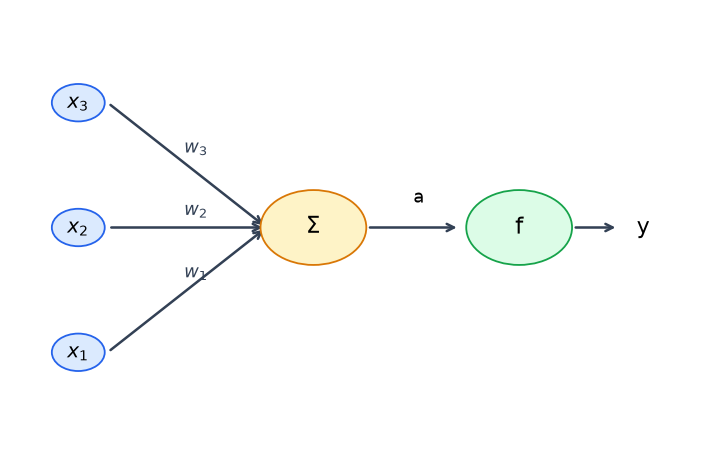
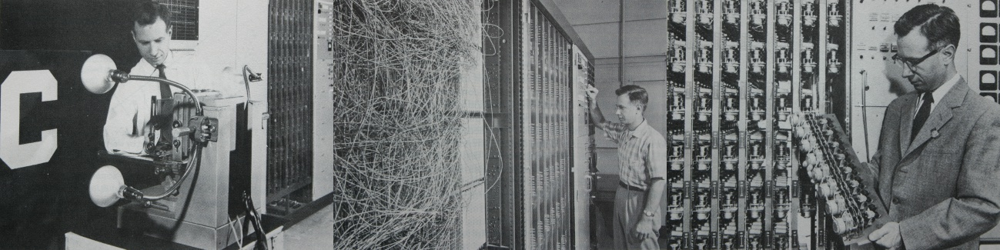
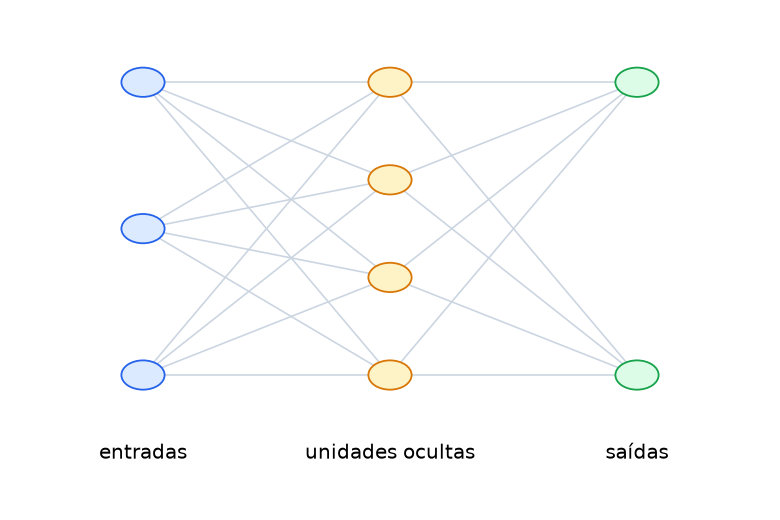
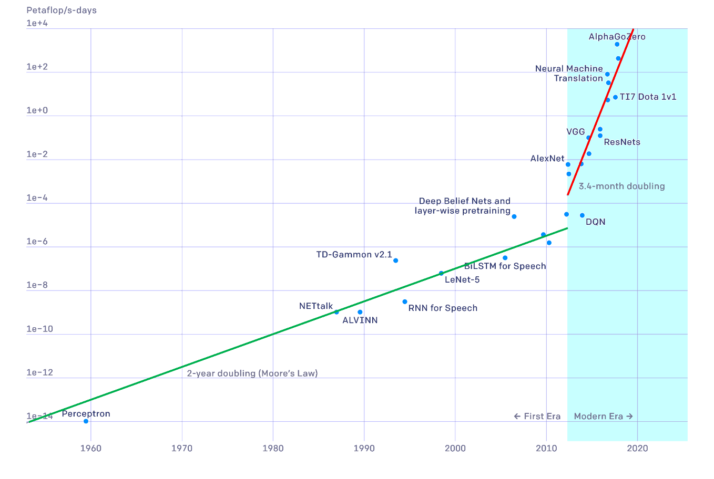

## Deep Learning

Baseado no Capítulo 1 — *The Deep Learning Revolution* — de:

> C. M. Bishop & H. Bishop, **Deep Learning: Foundations and Concepts**, Springer, 2024.

Roteiro do capítulo:

1. **O impacto** do Deep Learning — quatro exemplos
2. **Exemplo tutorial** — ajuste de curva polinomial
3. **Breve história** do aprendizado de máquina

---

## 1.1 O impacto do Deep Learning

* Machine learning: soluções aprendidas a partir de dados **substituem** algoritmos feitos à mão
* **Deep learning**: redes neurais profundas — o framework mais geral e poderoso de ML hoje
* Mesmo *framework* resolve problemas de domínios completamente diferentes

::: {.column width="100%"}
| Tipo de aprendizado | Ideia central |
|---|---|
| **Supervisionado** | dados rotulados $\to$ prevê rótulo/valor |
| **Não supervisionado** | dados sem rótulo $\to$ aprende estrutura |
| **Auto-supervisionado** | rótulos extraídos automaticamente dos próprios dados |
:::

---

## Diagnóstico médico

::: {.columns}
::: {.column width="55%"}
{width="100%"}

*Melanomas malignos (topo) vs. nevos benignos (base)*
:::
::: {.column .v-center-column width="45%"}
* Classificar lesão de pele: **maligna** ou **benigna**
* Rede treinada com ~129 mil imagens rotuladas (biópsia = verdade)
* ~**25 milhões** de pesos ajustáveis
* Exemplo de **classificação supervisionada**
* **Transfer learning**: pré-treino em 1,28M imagens genéricas $\to$ *fine-tuning* nas lesões
:::
:::

> Acurácia superior à de dermatologistas profissionais.

---

## Estrutura de proteínas

::: {.columns}
::: {.column width="45%"}
* Prever a forma 3D de uma proteína a partir da sequência de aminoácidos
* Problema em aberto há **50 anos**
* **AlphaFold** (Jumper et al., 2021)
* Também é **aprendizado supervisionado**: pares (sequência, estrutura 3D conhecida)
:::
::: {.column .v-center-column width="55%"}
{width="70%"}

*Verde: estrutura real (raio-X). Azul: predição do AlphaFold.*
:::
:::

---

## Síntese de imagens

::: {.columns}
::: {.column width="55%"}
{width="100%"}

*Rostos sintéticos — nenhuma dessas pessoas existe*
:::
::: {.column .v-center-column width="45%"}
* Dados de treino: apenas imagens, **sem rótulos**
* Exemplo de **aprendizado não supervisionado**
* **Modelo generativo**: gera novos exemplos plausíveis
* Condicionado a texto $\to$ **IA generativa** (imagem, vídeo, áudio, texto, moléculas...)
:::
:::

---

## Modelos de linguagem (LLMs)

* Constroem representações internas do significado da linguagem
* **Autorregressivos**: preveem a próxima palavra dado o texto anterior
* A sequência gerada realimenta o modelo $\to$ gera a próxima, e a próxima...
* Treino: **auto-supervisionado** — o "rótulo" é a próxima palavra do próprio texto
* Permite escalar para volumes massivos de dados sem rotulagem humana

> GPT-4 já foi descrito como uma primeira manifestação de inteligência artificial geral (Bubeck et al., 2023).

---

## 1.2 Exemplo tutorial: ajuste de curva

Problema clássico de **regressão** (supervisionado):

* Variável de entrada $x$, variável alvo $t$, ambas contínuas
* Dado um conjunto de treino $\{(x_n, t_n)\}_{n=1}^N$, prever $t$ para um novo $x$
* Capacidade de acertar dados **nunca vistos** = **generalização**

```{python}
#| echo: true
#| output: false
import numpy as np
import matplotlib.pyplot as plt

np.random.seed(42)
N = 10
x = np.linspace(0, 1, N)
x_true = np.linspace(0, 1, 200)
noise = np.random.normal(0, 0.25, N)
t = np.sin(2 * np.pi * x) + noise          # dados = seno + ruído gaussiano
```

---

## Dados sintéticos

```{python}
#| echo: false
#| output: true
plt.figure(figsize=(7, 4.5))
plt.scatter(x, t, facecolor="none", edgecolor="#2563eb", s=90, linewidth=1.8, label="dados (com ruído)")
plt.plot(x_true, np.sin(2*np.pi*x_true), color="#16a34a", linewidth=2, label=r"$\sin(2\pi x)$")
plt.xlabel("x"); plt.ylabel("t"); plt.legend()
plt.tight_layout()
plt.show()
```

A função verde é **desconhecida** na prática — o objetivo é descobri-la a partir dos pontos azuis.

---

## Modelo linear (nos parâmetros)

Ajuste por polinômio de grau $M$:

$$y(x, \mathbf{w}) = w_0 + w_1 x + w_2 x^2 + \ldots + w_M x^M = \sum_{j=0}^M w_j x^j$$

* Não linear em $x$, mas **linear nos coeficientes** $\mathbf{w}$
* Funções lineares nos parâmetros $\to$ **modelos lineares**

```{python}
#| echo: true
#| output: false
def MatrizRegressao(x, M):
    n = len(x)
    X = np.zeros((n, M + 1))
    for j in range(M + 1):
        X[:, j] = x**j
    return X
```

---

## Função de erro

Mede o desajuste entre o modelo e os dados — soma dos quadrados dos resíduos:

$$E(\mathbf{w}) = \frac{1}{2} \sum_{n=1}^N \{y(x_n, \mathbf{w}) - t_n\}^2$$

* $E(\mathbf{w})$ é **quadrática** em $\mathbf{w}$ $\to$ mínimo único, solução fechada $\mathbf{w}^\star$
* Resolvida com mínimos quadrados: $\mathbf{w}^\star = (\mathbf{X}^T\mathbf{X})^{-1}\mathbf{X}^T\mathbf{t}$

```{python}
#| echo: true
#| output: false
def MinimosQuadrados(X, t, lam=0.0):
    XtX = X.T @ X + lam * np.eye(X.shape[1])
    return np.linalg.solve(XtX, X.T @ t)
```

---

## Complexidade do modelo

```{python}
#| echo: false
#| output: true
graus = [0, 1, 3, 9]
fig, axes = plt.subplots(2, 2, figsize=(9, 7))
for ax, M in zip(axes.flatten(), graus):
    Xm = MatrizRegressao(x, M)
    w = MinimosQuadrados(Xm, t)
    pred = MatrizRegressao(x_true, M) @ w
    ax.scatter(x, t, facecolor="none", edgecolor="#2563eb", s=45)
    ax.plot(x_true, np.sin(2*np.pi*x_true), color="#16a34a", linewidth=1.2)
    ax.plot(x_true, pred, color="#dc2626", linewidth=2)
    ax.set_ylim(-1.6, 1.6); ax.set_title(f"M = {M}")
plt.tight_layout(); plt.show()
```

---

## Sub-ajuste vs. sobre-ajuste

* $M = 0, 1$: modelo **rígido demais** — não captura a oscilação (*underfitting*)
* $M = 3$: bom equilíbrio, próximo de $\sin(2\pi x)$
* $M = 9$: passa **exatamente** pelos pontos, $E(\mathbf{w}^\star) = 0$, mas oscila descontroladamente entre eles (*overfitting*)

```{python}
#| echo: false
#| output: true
np.random.seed(1)
x_test = np.random.uniform(0, 1, 100)
t_test = np.sin(2*np.pi*x_test) + np.random.normal(0, 0.25, 100)
rms = lambda p, y: np.sqrt(np.mean((p - y)**2))

Ms = range(10)
tr, te = [], []
for M in Ms:
    Xm = MatrizRegressao(x, M); w = MinimosQuadrados(Xm, t)
    tr.append(rms(Xm @ w, t))
    te.append(rms(MatrizRegressao(x_test, M) @ w, t_test))

plt.figure(figsize=(7, 4))
plt.plot(Ms, tr, 'o-', color="#2563eb", label="Treino")
plt.plot(Ms, te, 's-', color="#dc2626", label="Teste")
plt.xlabel("M"); plt.ylabel(r"$E_{RMS}$"); plt.legend()
plt.tight_layout(); plt.show()
```

---

## Os coeficientes explodem

```{python}
#| echo: false
#| output: true
import pandas as pd
linhas = {}
for M in [0, 1, 3, 9]:
    w = MinimosQuadrados(MatrizRegressao(x, M), t)
    linha = [f"{v:.1f}" for v in w] + [""] * (10 - len(w))
    linhas[f"M={M}"] = linha
pd.DataFrame(linhas, index=[f"w{i}*" for i in range(10)]).T
```

> Quanto maior $M$, maiores em módulo ficam os coeficientes: o modelo se ajusta ao **ruído**, não ao sinal.

---

## Regularização

Penaliza coeficientes grandes — adiciona um termo à função de erro:

$$\widetilde{E}(\mathbf{w}) = \frac{1}{2}\sum_{n=1}^N \{y(x_n,\mathbf{w}) - t_n\}^2 + \frac{\lambda}{2}\|\mathbf{w}\|^2$$

* Em redes neurais, essa técnica é chamada de **weight decay**
* $\lambda$ controla o trade-off entre ajuste aos dados e suavidade da curva
* Solução ainda em forma fechada — só muda a matriz do sistema linear

---

## Regularização — ajuste visual

```{python}
#| echo: false
#| output: true
fig, axes = plt.subplots(1, 2, figsize=(9, 4))
Xm9 = MatrizRegressao(x, 9)
for ax, lnlam in zip(axes, [-18, 0]):
    w = MinimosQuadrados(Xm9, t, lam=np.exp(lnlam))
    pred = MatrizRegressao(x_true, 9) @ w
    ax.scatter(x, t, facecolor="none", edgecolor="#2563eb", s=45)
    ax.plot(x_true, np.sin(2*np.pi*x_true), color="#16a34a", linewidth=1.2)
    ax.plot(x_true, pred, color="#dc2626", linewidth=2)
    ax.set_ylim(-1.6, 1.6); ax.set_title(f"ln λ = {lnlam}")
plt.tight_layout(); plt.show()
```

---

## Efeito de $\lambda$ na generalização

```{python}
#| echo: false
#| output: true
lnlams = np.linspace(-35, 0, 40)
Xte9 = MatrizRegressao(x_test, 9)
tr, te = [], []
for lnlam in lnlams:
    w = MinimosQuadrados(Xm9, t, lam=np.exp(lnlam))
    tr.append(rms(Xm9 @ w, t)); te.append(rms(Xte9 @ w, t_test))

plt.figure(figsize=(7, 4.3))
plt.plot(lnlams, tr, color="#2563eb", label="Treino")
plt.plot(lnlams, te, color="#dc2626", label="Teste")
plt.xlabel(r"$\ln \lambda$"); plt.ylabel(r"$E_{RMS}$"); plt.legend()
plt.tight_layout(); plt.show()
```

* $\lambda$ muito pequeno $\to$ sobre-ajuste; $\lambda$ muito grande $\to$ sub-ajuste
* Existe um **mínimo** de erro de teste em algum $\lambda$ intermediário

---

## Seleção de modelo

$M$ e $\lambda$ são **hiperparâmetros** — não podem ser ajustados minimizando $E(\mathbf{w})$ diretamente (levaria a $\lambda \to 0$ e $M$ grande)

* Dividir os dados: **treino** / **validação** / **teste**
* Escolher o modelo com menor erro na **validação**

::: {.columns}
::: {.column width="45%"}
{width="100%"}
:::
::: {.column .v-center-column width="55%"}
**Validação cruzada em S dobras (S-fold)**

* Dados divididos em $S$ partes iguais
* $S{-}1$ partes treinam, 1 parte avalia — repete $S$ vezes
* $S = N$ $\to$ *leave-one-out*
* Custo: $S\times$ mais treinos
:::
:::

---

## 1.3 Breve história do aprendizado de máquina

::: {.columns}
::: {.column .v-center-column width="45%"}
{width="100%"}
:::
::: {.column width="55%"}
* Redes neurais: inspiradas nos neurônios biológicos
* Cérebro humano: ~90 bilhões de neurônios, ~100 trilhões de sinapses
* Um neurônio "dispara" conforme a força (peso) das sinapses de entrada
* A força das sinapses muda com a experiência $\to$ é assim que o cérebro **aprende**
:::
:::

> Três fases na história das redes neurais: **camada única** $\to$ **backpropagation** $\to$ **redes profundas**

---

## Fase 1 — Redes de camada única

::: {.columns}
::: {.column width="45%"}
{width="100%"}

Um neurônio: entradas $x_i$, pesos $w_i$, soma $a$, ativação $f(a) = y$
:::
::: {.column width="55%"}
**Perceptron** (Rosenblatt, 1962): $f$ é uma função degrau

$$f(a) = \begin{cases} 0, & a \leqslant 0 \\ 1, & a > 0 \end{cases}$$

* Algoritmo de treino converge em passos finitos, **se** existir solução
* Minsky & Papert (1969): provaram limitações **fortes** de redes de camada única
* Especularam (erroneamente) que multicamadas teriam a mesma limitação $\to$ décadas de desinteresse
:::
:::

---

## O hardware do Perceptron (1958)

{width="100%"}

Câmera rudimentar (400 pixels) $\cdot$ *patch board* para religar conexões $\cdot$ pesos ajustados por **motores elétricos** girando potenciômetros

---

## Fase 2 — Backpropagation

::: {.columns}
::: {.column width="55%"}
{width="100%"}

Rede com uma camada oculta — informação flui **para frente**
:::
::: {.column .v-center-column width="45%"}
* Ativações **diferenciáveis** substituem a função degrau
* Gradiente do erro calculado eficientemente por **retropropagação** (Rumelhart, Hinton & Williams, 1986)
* Otimização por **gradiente descendente estocástico**
* Na prática, só as últimas camadas aprendiam bem $\to$ redes ficavam rasas
:::
:::

---

## Fase 3 — Redes profundas

::: {.columns}
::: {.column width="55%"}
{width="100%"}

Escala (dados + modelo + cômputo) supera melhorias arquiteturais isoladas (Sutton, 2019)
:::
::: {.column .v-center-column width="45%"}
* Desde 2012: cômputo cresce **dobrando a cada 3,4 meses**
* Antes (era do perceptron): dobrava a cada ~2 anos (Lei de Moore)
* **GPUs**: paralelismo massivo casa com o cálculo por camadas
* Redes com até ~$10^{12}$ parâmetros, treináveis graças a **conexões residuais** e **diferenciação automática**
:::
:::

---

## Ideias-chave do capítulo

* Mesmo *framework* de deep learning resolve problemas supervisionados, não supervisionados e auto-supervisionados
* **Generalização** — não decorar o treino — é o objetivo real do aprendizado
* **Complexidade do modelo** ($M$, $\lambda$...) precisa ser controlada: sub-ajuste $\leftrightarrow$ sobre-ajuste
* **Regularização** troca viés por variância para melhorar a generalização
* Hiperparâmetros exigem **validação** separada do treino e do teste
* Redes profundas = escala (dados + parâmetros + cômputo) + avanços como backprop, GPUs, conexões residuais

$$\text{dados} + \text{modelo} + \text{erro} + \text{otimização} \;\longrightarrow\; \text{aprendizado}$$
